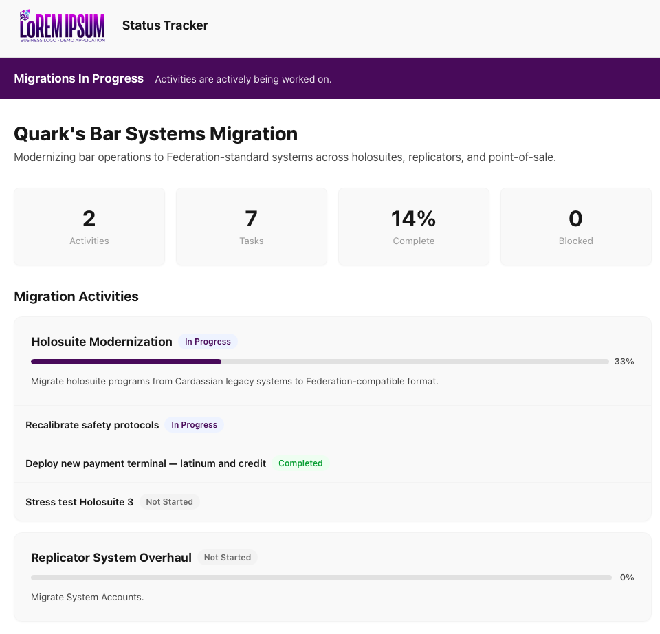
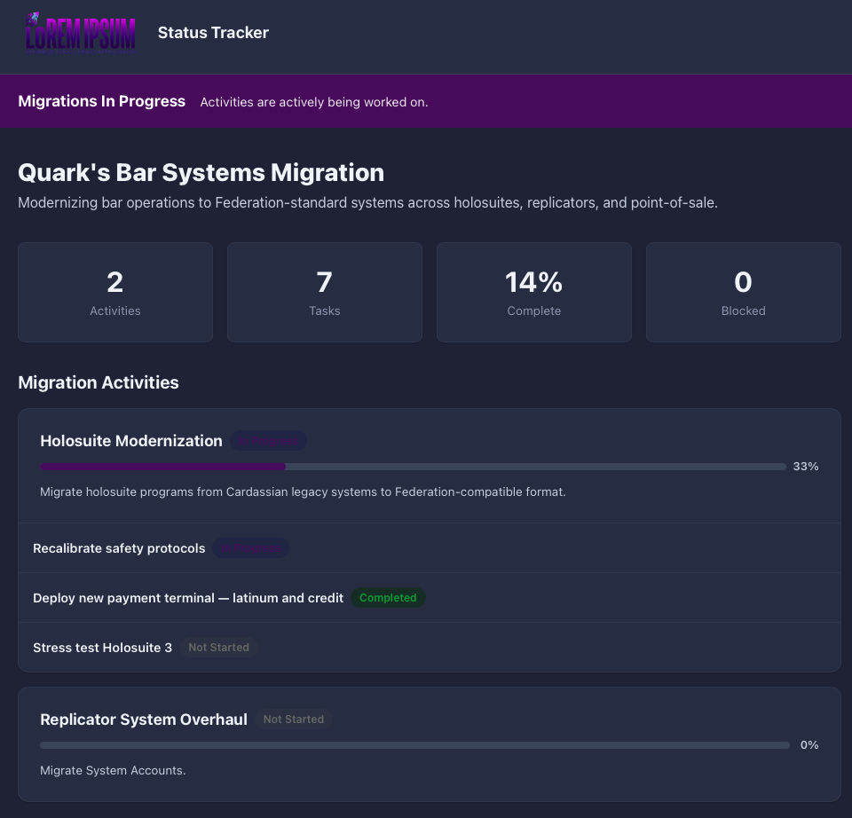

# StatusPage

A lightweight, single-page status dashboard for tracking short-duration migration events. Built with [Astro](https://astro.build/) and driven entirely by a single YAML configuration file.

Edit `src/data/migrations.yaml`, rebuild, and deploy — no database or backend required.

## Screenshots

### Light Mode



### Dark Mode



## Features

- Single YAML file drives all content — no database or backend
- Branded header with logo, company name, and configurable colors
- Summary metrics (activities, tasks, completion %, blocked count)
- Expandable activity cards with progress bars and task checklists
- Timeline of updates in reverse-chronological order
- Light and dark mode support
- Fully static output — deploy anywhere

## Prerequisites

- **Node.js** 18.17.1 or later (Node 20+ recommended)
- **npm** (included with Node.js)

## Quick Start

```bash
# Install dependencies
npm install

# Start the dev server (http://localhost:4321)
npm run dev
```

## Building & Deploying

### Static Export (default)

By default the site builds to a static `dist/` folder that can be served by any web server or CDN.

```bash
# Build static files
npm run build

# Preview the build locally
npm run preview
```

The output in `dist/` is plain HTML, CSS, and JS — upload it to any static host:

| Host | Deploy method |
|---|---|
| **Nginx / Apache** | Copy `dist/` contents to the web root |
| **GitHub Pages** | Push `dist/` to the `gh-pages` branch or configure Actions |
| **Netlify / Vercel** | Set build command to `npm run build` and publish directory to `dist` |
| **S3 + CloudFront** | Use the [Terraform module](scripts/s3/terraform/) or [shell scripts](scripts/s3/) |

### S3 + CloudFront (Terraform)

A Terraform module under [`scripts/s3/terraform/`](scripts/s3/terraform/) provisions the full AWS stack:

- S3 bucket (public access blocked, served via CloudFront OAC)
- CloudFront distribution with HTTPS redirect
- Optional custom domain (ACM certificate with DNS validation)
- Optional AWS WAF with managed rule groups and CloudWatch logging
- Configurable geographic restrictions (defaults to US-only whitelist)

```bash
cd scripts/s3/terraform
terraform init
terraform apply -var="bucket_name=my-statuspage-bucket"
```

For quick manual deploys to an existing bucket, shell scripts are also available — see [`scripts/s3/`](scripts/s3/).

### Node.js Server (SSR)

To run as a Node.js server instead of a static site:

1. Install the Node adapter:

```bash
npm install @astrojs/node
```

2. Update `astro.config.mjs`:

```js
import { defineConfig } from 'astro/config';
import yaml from '@modyfi/vite-plugin-yaml';
import node from '@astrojs/node';

export default defineConfig({
  output: 'server',
  adapter: node({
    mode: 'standalone',
  }),
  vite: {
    plugins: [yaml()],
  },
});
```

3. Build and run:

```bash
npm run build
node dist/server/entry.mjs
```

The server starts on `http://localhost:4321` by default. Set the `PORT` and `HOST` environment variables to customize.

## Configuring `migrations.yaml`

All content is driven by a single file: **`src/data/migrations.yaml`**. After making changes, rebuild (or let the dev server hot-reload) to see updates.

### Full Schema

```yaml
# ── Branding ──────────────────────────────────────────────
branding:
  companyName: "Acme Corp"          # Displayed in the site header (leave "" to hide)
  logoUrl: /logo.png                # Path to logo in the public/ folder
  primaryColor: "#2563eb"           # Primary brand color (banner, accents)
  secondaryColor: "#fafafa"         # Secondary/background color

# ── Site Metadata ─────────────────────────────────────────
siteTitle: Migration Status
siteDescription: Track the progress of our platform migration activities.

# ── Activities ────────────────────────────────────────────
activities:
  - id: unique-slug                 # Unique identifier for the activity
    name: Email Migration           # Display name
    description: Short summary of what this activity covers.
    status: in-progress             # not-started | in-progress | completed
    tasks:
      - name: Backup email systems  # Task display name
        status: completed           # not-started | in-progress | completed

# ── Updates (timeline) ───────────────────────────────────
updates:
  - date: "2026-02-20T14:30:00Z"   # ISO 8601 timestamp
    message: Description of what happened.
```

### Section Reference

#### `branding`

| Field | Type | Description |
|---|---|---|
| `companyName` | string | Company name shown in the header. Leave empty (`""`) to hide. |
| `logoUrl` | string | Path to a logo image placed in the `public/` directory. |
| `primaryColor` | string | Hex color used for the banner and accents. |
| `secondaryColor` | string | Hex color used for backgrounds. |

#### `siteTitle` / `siteDescription`

Top-level strings used for the page heading and the HTML `<meta>` description.

#### `activities`

Each activity represents a major workstream with its own progress bar and task checklist.

| Field | Type | Required | Description |
|---|---|---|---|
| `id` | string | yes | Unique slug for the activity. |
| `name` | string | yes | Display name shown on the card. |
| `description` | string | yes | Short summary shown below the name. |
| `status` | string | yes | One of: `not-started`, `in-progress`, `completed`. |
| `tasks` | list | yes | Sub-tasks displayed as a checklist (see below). |

#### `tasks` (nested under each activity)

| Field | Type | Required | Description |
|---|---|---|---|
| `name` | string | yes | Task display name. |
| `status` | string | yes | One of: `not-started`, `in-progress`, `completed`. |

The progress bar on each activity card is calculated automatically from the ratio of `completed` tasks to total tasks.

#### `updates`

A flat list of timeline entries displayed in reverse-chronological order.

| Field | Type | Required | Description |
|---|---|---|---|
| `date` | string | yes | ISO 8601 datetime string (e.g. `"2026-02-20T14:30:00Z"`). |
| `message` | string | yes | Free-text description of the update. |

### Status Values

The following statuses are supported and each renders with a distinct color badge:

- **`not-started`** — work has not begun
- **`in-progress`** — actively being worked on
- **`completed`** — finished

## Project Structure

```
src/
  components/
    ActivityCard.astro      # Expandable card per activity
    ActivityList.astro      # Container for all activity cards
    Banner.astro            # Top-of-page status banner
    ProgressBar.astro       # Visual progress indicator
    SiteHeader.astro        # Logo + company name header
    StatusBadge.astro       # Colored status pill
    SubTaskRow.astro        # Single task checklist row
    SummaryMetrics.astro    # High-level metrics section
    Timeline.astro          # Updates timeline container
    TimelineEvent.astro     # Single timeline entry
  data/
    migrations.yaml         # All configuration lives here
  layouts/
    BaseLayout.astro        # HTML shell, global styles
  pages/
    index.astro             # Main page (wires data to components)
public/                     # Static assets (logos, images)
assets/                     # Repository assets (screenshots)
scripts/
  s3/
    deploy.sh               # Bash deploy script
    deploy.ps1              # PowerShell deploy script
    terraform/              # Terraform module (S3 + CloudFront)
```

## License

Private — internal use only.
